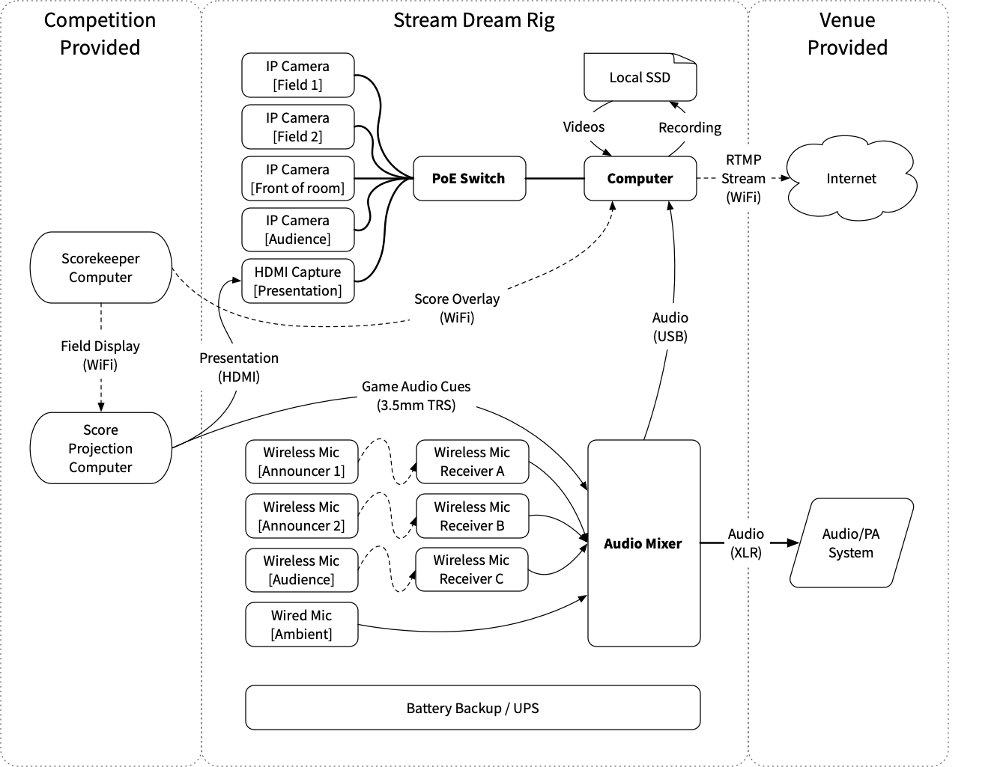

# Hardware

The *Stream Dream "Rig"* includes the following:
  - Flight case with rack mounting slots for equipment and audio mixer
  - Battery backup
  - Computer, including a monitor, keyboard, and mouse
  - Network switch, with 802.3af power over Ethernet (PoE) capability
  - Audio mixer, with USB output
  - Wireless microphones and receivers

# Architecture

The typical interconnections of the hardware in the Stream Dream Rig looks like the following:

## Flight case

The "flight case" style enclosure holds everything together. It has a few rack mount slots (measured in rack units, "RUs") for equipment stacked vertically, and some rack space at an angle on top, designed for the installation of an audio mixer.

## Battery backup

The rig includes a small UPS in order to allow the live stream to survive short power interruptions such as the extension cord being accidentally unplugged or to reroute or reconnect power. The provided UPS is capable of powering the rig (not including the monitor) for about 20 minutes. 

## Computer

The computer is the heart of the rig. It's nothing crazy spec-wise, but has a good CPU with many cores, a decent amount of memory, and a fast SSD for storage. Additionally, it has wired Gigabit Ethernet ports, and two WiFi adapters (one M.2 internal card, and one USB).

A compact 22-inch touchscreen monitor is provided, as well as a wireless keyboard and mouse.

## Network switch

In order to connect the computer to all the cameras, a PoE switch is installed in the cabinet, with plenty of ports for as many cameras and other equipment that needs a network connection to the computer.

#### Usage of Power over Ethernet

In order to run for an entire day of video streaming, typical cameras (camcorders, etc.) would need to use a "power brick" adapters, and they would usually output their video using HDMI. This would mean running extension cords to power them, and using long (out of spec) and very expensive HDMI cables. These were identified as major problems early in the design of this streaming system. One of the key designs of the hardware chosen for the Stream Dream Rig is to use network-based IP cameras powered by PoE, so that they can be powered from and return their video using a single cable – which is easy to terminate on-site.

#### Why not use WiFi cameras?

There are many IP cameras available that use WiFi, but they were not considered for a few reasons:
* They would still need to be powered, so some cabling needs to exist.
* The FIRST Tech Challenge robots use WiFi (typically 2.4 GHz WiFi Direct), so it was necessary to avoid saturating available WiFi bandwidth to avoid causing problems for the robots themselves.
* Aside from the robots' wireless networks, competitions are typically run in schools or other facilities with full-coverage WiFi, further saturating the available WiFi bandwidth.

## Audio mixer and microphones

Although video is the most obvious requirement of a video stream, audio is a key part of streaming: without audio, a video stream is not that fun to watch. With bad audio, a stream can be downright painful to watch. In addition to greatly improving the live stream experience for viewers, good audio also makes the captured video much more useful for ongoing usage after the event, such as publishing the videos on YouTube.

In order to capture audio well, we need all important audio to go through *_our_* audio mixer, so that it can be output to the stream as well as amplified in the venue using provided audio amplification equipment 

#### Wireless microphones and receivers for the announcers

The Stream Dream Rig provides two Shure SM58 handheld wireless microphones, and the flight case includes the Shure BLX4R rack-mounted receivers (with remote-mounted antennas) for them.

#### Audio cues patched from the scorekeeper

The game audio cues should be patched from the computer displaying the main score/timer display (typically on a projector) and input into the audio mixer for capturing on the stream and amplification in the venue.

#### Ambient audience microphones

The announcers typically are carrying their microphones around and turning them on and off constantly, and during some parts of the event both microphones may be off. In order to provide viewers a more consistent and interesting experience, one or more microphones is used to capture ambient sounds of audience and venue. This typically captures clapping, cheering, etc. A wired or wireless microphone may be placed anywhere in the venue, typically near the audience. 

#### What about music?

Any music played in the venue _must not_ be fed into the live stream, otherwise live streaming providers such as Twitch are forced to mute the audio of the stream due to copyright concerns. Music may be played using the same PA system (using an additional input), or a separate one. Care should be taken to avoid capturing the music in high fidelity and especially patching it directly into the live stream audio.