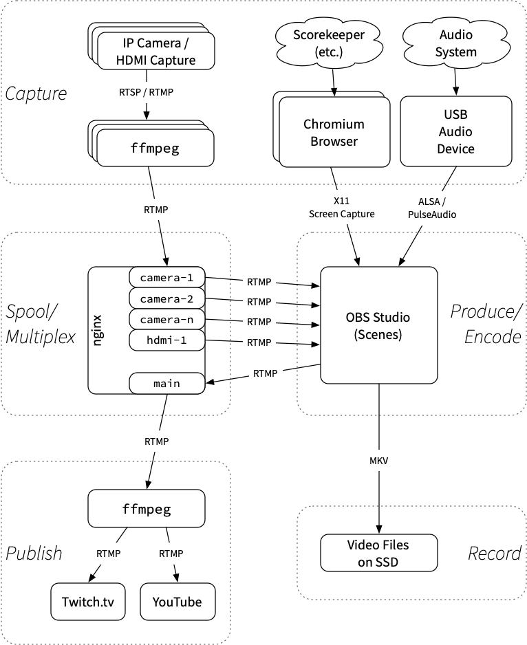

# Software

The software used in Stream Dream consists of a few major components:

* [OBS Studio](https://obsproject.com/), a very popular Open Source software package for live video production and streaming. (With some modifications by myself.)
* [nginx](https://nginx.org/en/) with [nginx-rtmp-module](https://github.com/arut/nginx-rtmp-module), a highly scalable and high performance proxy used in this case as a spool and multiplexer for RTMP real-time video streams.
* [ffmpeg](https://www.ffmpeg.org/), a very reliable and flexible video transcoder (amongst other great features) used to copy live video streams in real time.
* [Xvfb](https://www.x.org/releases/X11R7.6/doc/man/man1/Xvfb.1.xhtml), a virtual frame buffer to allow headless displays.
* [Chromium Browser](https://www.chromium.org/), the Open Source software which is the basis for Google Chrome.

# Architecture

The overall software architecture looks like the following:



# OBS Studio

The magic mostly happens in OBS Studio: It's a very advanced and very capable live video production system. The various live video streams and screen captures, along with other assets such as images and pre-produced videos and assembled into "Scenes" which are switched live during the event.

## Modifications required

Although OBS generally works great for our usage, and had _support_ for the network video sources we used, it needed some modifications in a couple of different ways:
* It has not been designed to minimize latency in the video stream coming from network video sources. In order to keep latency as low as possible, we made a [modification to OBS to allow buffering of the stream to be set to zero](https://github.com/obsproject/obs-studio/pull/2384).
* When a video source is not displayed in the current scene, the stream would be stopped. This causes a small delay re-establishing the stream each time the scene is changed, causes the preview scene to have blank video, and runs a risk of the stream failing to start. In order to keep the video stream running all the time, we patched OBS to have an option for this. (TODO: Submit this patch upstream.)

We expect these modifications to be available in a future version of OBS without modification.

# nginx and nginx-rtmp-module

We are using `nginx` as a "spool" (collecting the video streams) and multiplexer (collecting multiple streams). This allows a few things:
* Each video stream can have multiple consumers without needing to stream from the camera itself for each consumer. For instance, multiple OBS instances could use the same video stream simultaneously, and the raw video feeds can be sent to projectors and displays in other locations.
* The video streams are continuously ingested from the cameras to the Stream Dream Rig at all times, even if a particular video feed is not being used at the time. This allows for minimum startup time each time the stream is opened.
* Publishing the output from OBS through the local `nginx` allows the stream output to be consumed by multiple users simultaneously, for instance to be displayed on a projector or sent to both YouTube and Twitch simultaneously.

The following configuration is added to `nginx.conf`:

```
rtmp {
    server {
        listen 1935;
        chunk_size 4096;

        application live {
            live on;
            record off;
            wait_key on;
            wait_video on;
        }
    }
}
```

This allows any application to publish to `nginx` via `rtmp://<ip address>/live/<key>` where the `<key>` can be any name desired. The stream can then be played from the same address. (Note: There is no authentication of any sort here, so be careful running this on any open network.)

# ffmpeg

Currently `ffmpeg` is used for two purposes:

* Copying all of the RTSP streams from the cameras to the RTMP sinks in `nginx` so that they can be consumed by OBS reliably (as well as by other consumers as necessary).
* Publishing the RTMP output stream by copying from `nginx` to external destinations such as Twitch.tv or YouTube.

## Typical ffmpeg commands

Stream copy from an RTSP camera (such as a Ubiquiti UVC G3 Flex that we use) to the local `nginx` via RTMP (the `OUTPUT_URI` is typically e.g. `http://127.0.0.1/live/camera-1`:

```
/usr/bin/ffmpeg \
  -hide_banner \
  -nostats \
  -avioflags direct \
  -rtsp_transport tcp \
  -fflags nobuffer \
  -flags low_delay \
  -i ${INPUT_URI} \
  -c:v copy \
  -filter_complex "aresample=async=1000" \
  -f flv \
  ${OUTPUT_URI}
```

Stream copy to e.g. Twitch.tv (the `OUTPUT_URI` would look like e.g. `rtmp://live-lax.twitch.tv/app/your-stream-key`):

```
/usr/bin/ffmpeg \
  -hide_banner \
  -nostats \
  -fflags nobuffer \
  -flags low_delay \
  -i ${INPUT_URI} \
  -c:v copy \
  -c:a copy \
  -f flv \
  ${OUTPUT_URI}
```