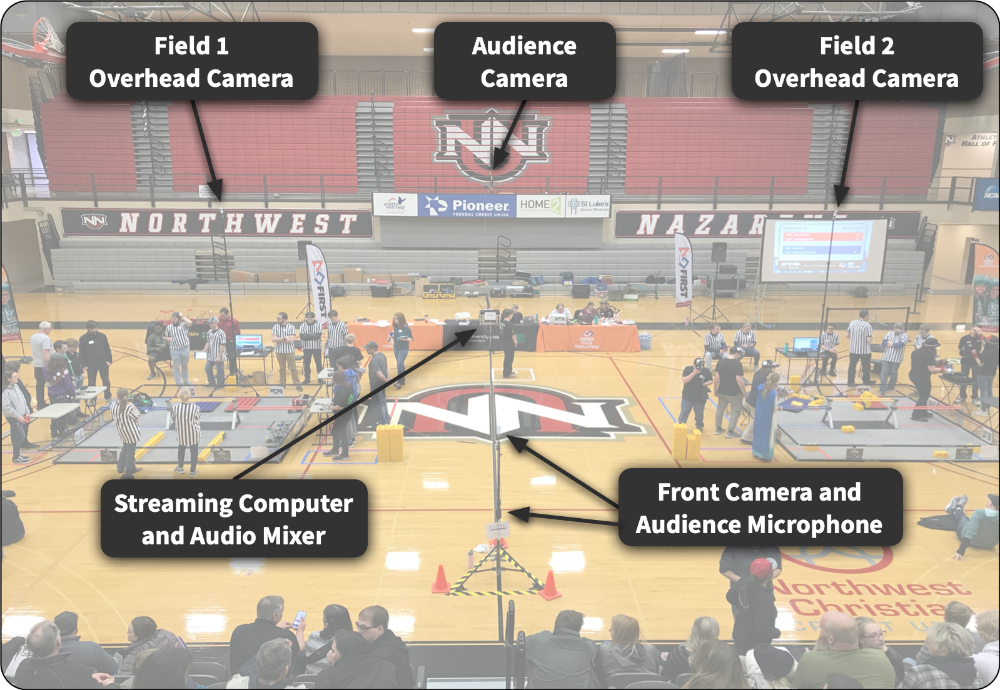

# Venue Setup

A typical setup for a competition includes the following:
* The [Stream Dream Rig](../Hardware.md), which includes:
* A 13-foot tripod at the edge of each field with a PoE camera mounted atop it looking down
* A PoE camera somewhere in the back of the room, ideally up high, to provide some context and show the audience
* A tripod at the front of the room, near the audience, with a PoE camera facing towards the presenters 
* A microphone placed near the audience, to capture clapping/cheering and general ambient sounds
* Two wireless handheld microphones for announcer/presenter use
* A connection from the audio mixer whatever audio amplification system is in use (either a portable one or the venue-installed one)
* A (typically 3.5mm audio cable) connection to the computer running the projector/timer 
* A WiFi connection to the network where the FTC scorekeeper is running

This is how the setup usually looks:

